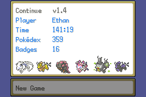
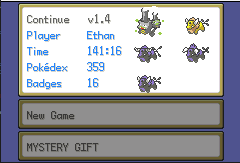

## continue-screen-icons

This code takes the party that the player has and prints it to the continue screen.  This also sacrifices the possibility of the Mystery Gift option, but that remains unused in hacks as-is.



Alternatively, if you just want it to print to the side of the Continue menu such that it overlaps a little with the borders and preserves the Mystery Gift option:



Just revert to commit [``4c7db384``](https://github.com/BluRosie/firegold-code/commit/4c7db38482e96da1ee9156817f13ec0071671c20) and build using that.

### Build Instructions

Build the same as the CFRU:  `python scripts/make.py`

#### Cloning the repo

Open your terminal to whatever folder you want to download this repo into. Then, do the following to download the repo:

```shell
$ git clone https://github.com/BluRosie/firegold-code.git
$ cd firegold-code
```

Alternatively, you can download the code as a .zip file from the arrow above.  You can navigate to whichever branch for whichever feature you would like to check out as well.

#### Adding your ROM

Copy your ROM to this directory and rename it `BPRE0.gba`.

#### Configuration

##### Compile Time Constants

Open [scripts/make.py](https://github.com/BluRosie/firegold-code/blob/template/scripts/make.py#L12) in a text editor to set some compile-time configuration.

The build system is smart enough to find enough free space on its own, and if you want it to be inserted at a particular address, you can specify it by updating the definition of `OFFSET_TO_PUT`:

```python
OFFSET_TO_PUT = 0x1C88650
SEARCH_FREE_SPACE = True   # Set to True if you want the script to search for free space
                           # Set to False if you don't want to search for free space as you for example update the engine
```

The build system will use `OFFSET_TO_PUT` to determine where in the ROM it should start looking for free space if `SEARCH_FREE_SPACE` is `True`.  Otherwise, the build system places the code to insert directly at `OFFSET_TO_PUT`.

#### Building the project itself

Once you're ready, run:

```shell
$ python scripts/make.py
```

This won't actually modify `BPRE0.gba`, instead your output will be in `test.gba`. Naturally, test it in an emulator before continuing.

### Credits

Research made possible by [pokeemerald](https://github.com/pret/pokeemerald) and [pokefirered](https://github.com/pret/pokefirered).

Spherical Ice initially made the [Unown Report code](https://github.com/sphericalice/bpre-unown-report).  I forked it and ported it to the [CFRU's build system](https://github.com/BluRosie/bpre-unown-report).

Skeli made the [build system used in the CFRU](https://github.com/Skeli789/Complete-Fire-Red-Upgrade) which is used here.
